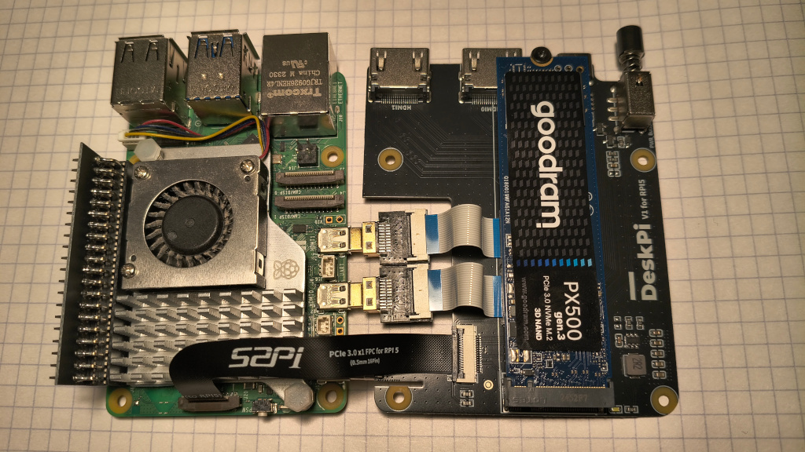
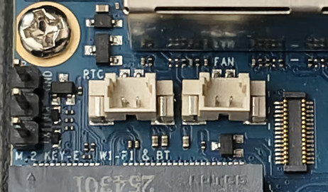

---
title: "Cold and Darkness"
description: "Cases and cooling for SBCs, part I"
date: 2026-09-08T11:10:00+02:00
math: false
license: "CC BY-NC-SA 4.0"
hidden: false
comments: true
draft: false
tags:
- SBC
categories:
- Hardware
----------

After several weeks of experimenting with various SBCs, the time finally came to provide them with two basic necessities: a proper case and proper cooling.

Neither is always as straightforward as it sounds, so I decided to document the process.

# Raspberry Pi 5 and DeskPi

## Assembly

For the Raspberry Pi 5, one can buy a **DeskPi** kit.

Which is exactly what I did.

The word *kit* is particularly appropriate here, because the box contains:

* the case itself,
* a fan,
* thermal pads,
* a multifunction adapter board.

That last item is by far the most interesting part.

It acts as an M.2 NVMe adapter, converts the Raspberry Pi's micro-HDMI connectors to full-size HDMI, reroutes USB-C power, and adds a proper physical power button.

In other words, it fixes several things one might reasonably wish had been there from the beginning.

DeskPi's own product description confirms support for M.2 NVMe drives, full-size HDMI through an adapter board, rerouted USB-C, and a power switch.

> Assembly is not particularly difficult.

> **Except for the ribbon cable.**

The first step is to throw the manual into the trash.

Unless you own a paper shredder.

In that case, use the shredder.

I envy you.

Trust me: the manual will not help much.

I had already been using an NVMe drive with my Raspberry Pi 5, so I first had to dismantle the existing setup and remove the **Pimoroni NVMe Base**.

A very good product, incidentally.

Just no longer useful in this particular configuration.

The USB-C and HDMI extension pieces fit without much trouble, and most of the assembly is pleasantly uneventful.

If you do not already have a fan installed, this is a good moment to add one.

Remember the thermal pads.

My Raspberry Pi 5 already had the official active cooler installed, and I decided to keep it because it works perfectly well.

The one thing that deserves disproportionate attention is the PCIe ribbon cable.

Yes, it can physically be inserted in more than one orientation.

No, only one of them is useful.

The final result should look like this:



If it does not, you may spend several enjoyable hours wondering why the Raspberry Pi can no longer see the NVMe drive.

I did.

> No, the manual does not clearly explain the ribbon orientation.

> Do not retrieve it from the trash.

If the Raspberry Pi already booted from NVMe before moving into the case, there is a good chance it will continue doing so without any additional changes.

That was exactly what happened in my case.

No new `config.txt` entries.

No bootloader changes.

Nothing.

Null.

Nada.

However, my bootloader had already been configured for NVMe booting beforehand, so a fresh setup may require additional preparation.

## Testing

Once everything works and the case is properly assembled, it seems reasonable to perform a few basic stress tests.

I used:

* `stress-ng`,
* `fio`,
* `nvme-cli`.

First:

```bash
sudo apt install nvme-cli fio stress-ng
```

The NVMe drive temperature can be read with:

```bash
sudo nvme smart-log /dev/nvme0 | grep temperature
```

The CPU temperature on Raspberry Pi can be checked with:

```bash
vcgencmd measure_temp
```

The first test applies ten minutes of CPU and memory pressure:

```bash
stress-ng \
    --cpu 0 \
    --vm 4 \
    --vm-bytes 60% \
    --timeout 10m \
    --metrics-brief
```

The second one produces sustained I/O activity:

```bash
fio \
    --name=nvme-test \
    --filename=/tmp/fio.test \
    --size=4G \
    --rw=readwrite \
    --bs=1M \
    --iodepth=32 \
    --direct=1 \
    --runtime=5m \
    --time_based \
    --group_reporting
```

A small warning here:

the `fio` test writes data to the selected file.

In this example that file is `/tmp/fio.test`, which is intentional.

Do not casually replace it with a block device unless destroying data is part of the experiment.

## Results

The NVMe drive peaked at around **50°C**.

The CPU reached **73.6°C**.

For a Raspberry Pi 5 under sustained load inside a compact case, I consider that perfectly acceptable.

# Orange Pi 5 Plus and the GeekPi Case

## Assembly

The GeekPi case is a black aluminum enclosure.

It is appropriately ugly.

It is also extremely well suited to the Orange Pi 5 Plus, which is much more important.

The case accommodates an **M.2 2280** drive and has a top-mounted fan that moves air across a larger portion of the board rather than cooling only the SoC.

The kit also includes thermal pads and small heatsinks.

Unlike the DeskPi manual, the product page does a reasonably good job of showing where everything belongs.

Progress.

There is, however, one complication:

the fan.

The Orange Pi 5 Plus provides a dedicated two-pin **FAN** connector using a small JST-style plug, while the fan included with the case terminates in two separate DuPont connectors intended for GPIO pins.

If one simply wants the fan to run continuously, it can be connected to:

* `+5V`,
* `GND`.

This works.

The disadvantages are equally obvious:

* the fan runs all the time,
* there is no temperature control,
* two GPIO header pins are occupied,
* even a quiet fan becomes surprisingly noticeable after several hours.

I wanted the board itself to control the fan.

## Modifying the Fan Cable

The dedicated Orange Pi fan connector is intended to cooperate with software-controlled fan handling.

On current Linux setups this is typically exposed through the kernel's `pwm-fan` mechanism and device-tree configuration. Orange Pi documentation and Armbian discussions show temperature-dependent fan levels rather than a simple permanently powered connection.

That sounded much better.

I bought a handful of inexpensive 1.25 mm JST pigtails and prepared to modify the cable.



Before soldering anything, I checked the connector electrically with a multimeter.

This is highly recommended.

Do not trust wire colors alone.

Do not trust random diagrams found in image search.

Do not trust yourself after midnight.

I connected a JST pigtail to the FAN header, powered on the Orange Pi, and observed the behavior while increasing CPU temperature with `stress-ng`.

The test confirmed that the dedicated connector was being controlled according to temperature.

With that established, the rest was simple:

* cut off the DuPont connectors,
* strip roughly one centimeter of insulation from the fan wires,
* strip the JST pigtail wires,
* slide heat-shrink tubing onto the wires **before soldering**,
* solder the matching wires,
* move the heat-shrink tubing over the joints,
* gently heat it until it contracts.

The third item deserves special emphasis.

Most people remember heat-shrink tubing immediately after finishing the solder joint.

This is one of the traditional stages of electronics education.

## Testing

After carefully assembling the case again, it was time for another round of tests.

First, the tools:

```bash
sudo apt install nvme-cli fio stress-ng
```

The NVMe temperature:

```bash
sudo nvme smart-log /dev/nvme0 | grep temperature
```

For the Orange Pi under Armbian, system temperature can conveniently be monitored with:

```bash
armbianmonitor -m
```

The output refreshes every few seconds and includes the SoC temperature.

The same stress tests can then be repeated:

```bash
stress-ng \
    --cpu 0 \
    --vm 4 \
    --vm-bytes 60% \
    --timeout 10m \
    --metrics-brief
```

and:

```bash
fio \
    --name=nvme-test \
    --filename=/tmp/fio.test \
    --size=4G \
    --rw=readwrite \
    --bs=1M \
    --iodepth=32 \
    --direct=1 \
    --runtime=5m \
    --time_based \
    --group_reporting
```

## Results

The NVMe drive peaked at **44°C**.

The CPU briefly reached **68.4°C**.

At that point, the fan came alive.

Afterward, the temperature rarely exceeded roughly **65°C** under the same workload.

That is exactly the kind of behavior I wanted: silent when cooling is unnecessary, audible only when the board actually needs help.

And, most importantly, controlled by the SBC rather than permanently wired to five volts like a tiny desk fan from 1997.

# To Be Continued

Two boards down.

Several still waiting.

In the next part:

* **Odroid M2**,
* **Raspberry Pi 500+**.

One of them has a perfectly reasonable case.

The other has opinions.
