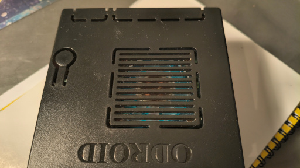
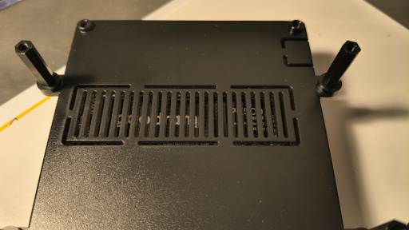

---
title: "Cold and Darkness (II)"
description: "Cases and cooling for SBCs, part II"
date: 2026-09-15T15:20:00+02:00
math: false
license: "CC BY-NC-SA 4.0"
hidden: false
comments: true
draft: false
tags:
- SBC
categories:
- Hardware
----------

In this episode, two more machines go through the usual treatment:

* **Raspberry Pi 500+**,
* **Odroid M2**.

They are interesting for very different reasons.

One is essentially a complete computer hidden inside a keyboard.

The other is a traditional SBC that still needs a case, cooling, and a little persuasion before it behaves properly under sustained load.

## Raspberry Pi 500+

The next machine is the **Raspberry Pi 500+**.

I bought mine at a very good price, and it turned out to be an excellent purchase.

It comes with:

* a mechanical keyboard,
* 16 GB of RAM,
* a factory-installed **256 GB NVMe SSD**.

The mechanical keyboard obviously has no effect on CPU performance or temperature.

I simply happen to be a very big fan of mechanical keyboards.

Perhaps there will be an episode about those one day.

That is a threat.

The other two features are considerably more practical.

A proper SSD is a much better place for an operating system than an SD card, and nobody has ever become ill from having too much RAM.

Except perhaps after looking at the invoice.

As mentioned earlier, though, I bought this particular machine at a substantial discount — considerably cheaper than any other bare SBC in my collection with comparable NVMe support.

The Raspberry Pi 500+ is an all-in-one design, with all the electronics enclosed inside the keyboard case.

The result looks a little like a modern, simplified **Amiga 500**, or one of the classic home computers from the 1980s and 1990s.

That is not accidental.

Raspberry Pi itself described the 500+ as a tribute to the home computers many of us grew up with.

What is less obvious without opening the case is how exactly the cooling has been implemented.

Questions include:

* how the CPU is cooled,
* where thermal pads are used,
* whether additional heatsinks are present,
* how the NVMe drive is cooled.

The SSD itself is also something you mostly know about from the specification rather than from direct visual inspection.

Yes, I know.

I could open the case.

Unfortunately, one of the screws appears to have made a personal decision to remain exactly where it is.

And since the machine works perfectly well, for now I am satisfied with knowing that it works perfectly well.

That is, after all, what I bought it for.

### Testing

The same tests used earlier for the **Orange Pi 5 Plus** and the **Raspberry Pi 5** in the DeskPi case work perfectly well here.

For the NVMe temperature:

```bash
sudo nvme smart-log /dev/nvme0 | grep temperature
```

For the Raspberry Pi itself:

```bash
vcgencmd measure_temp
vcgencmd measure_clock arm
vcgencmd get_throttled
```

The first command reports CPU temperature.

The second shows the current ARM clock frequency.

The third is especially useful because it reveals whether the system has experienced thermal throttling, undervoltage, or related issues.

The CPU and memory stress test:

```bash
stress-ng \
    --cpu 0 \
    --vm 4 \
    --vm-bytes 60% \
    --timeout 10m \
    --metrics-brief
```

And the I/O test:

```bash
fio \
    --name=nvme-test \
    --filename=/tmp/fio.test \
    --size=4G \
    --rw=readwrite \
    --bs=1M \
    --iodepth=32 \
    --direct=1 \
    --runtime=5m \
    --time_based \
    --group_reporting
```

As before, `fio` writes data to the selected file.

In this example, that file is `/tmp/fio.test`.

Do not spontaneously replace it with a block device unless ruining the rest of your day is part of the benchmark.

### Results

| Component | `stress-ng` |   `fio` |
| --------- | ----------: | ------: |
| NVMe      |       35 °C |   31 °C |
| CPU       |     47.7 °C | 37.8 °C |

Compared with the other SBCs tested so far, these results are excellent.

Especially considering that the whole computer is enclosed inside a keyboard.

It looks very much as though the engineers behind the **Raspberry Pi 500+** did an exceptionally good job.

One might even say they did their homework.

Although in Poland in 2026, that metaphor now requires a little caution.

## Odroid M2

The **Odroid M2** arrived with its standard case and cooling fan.

The enclosure is made of plastic, which initially made me wonder whether it would cope well with sustained heat, especially from the NVMe drive.

As it turns out, the design is quite sensible.

The top of the case contains ventilation openings directly around the fan area.

The underside has openings near the NVMe drive.




This strongly suggests that the intended cooling strategy is airflow rather than pressing the SSD against the enclosure through a thermal pad.

So I left it exactly as designed.

Assembly took perhaps three minutes.

Which is always suspicious.

Usually, if assembling an SBC takes only three minutes, it means you forgot something.

Not this time.

Hardkernel itself notes that the Odroid M2 can generate enough heat under sustained CPU and GPU load to require active cooling, which is why a fan is included in the kit. Its speed can be controlled using PWM.

### Testing

The tests were identical to the previous ones.

For NVMe temperature:

```bash
sudo nvme smart-log /dev/nvme0 | grep temperature
```

For SoC temperature under Armbian:

```bash
armbianmonitor -m
```

Then:

```bash
stress-ng \
    --cpu 0 \
    --vm 4 \
    --vm-bytes 60% \
    --timeout 10m \
    --metrics-brief
```

and:

```bash
fio \
    --name=nvme-test \
    --filename=/tmp/fio.test \
    --size=4G \
    --rw=readwrite \
    --bs=1M \
    --iodepth=32 \
    --direct=1 \
    --runtime=5m \
    --time_based \
    --group_reporting
```

### Results

| Component | `stress-ng` |   `fio` |
| --------- | ----------: | ------: |
| NVMe      |       46 °C |   50 °C |
| CPU       |       61 °C | 59.2 °C |

Before running the tests, I was slightly concerned that every SBC enclosed in a metal case would outperform the plastic Odroid by a wide margin.

That did not happen.

The CPU remained comfortably below troublesome temperatures, and the NVMe temperature was perfectly reasonable as well.

So plastic does not always mean:

> this is going to get hot.

Sometimes it simply means:

> someone designed the airflow properly.

## To Be Continued

Next time:

**Rock 5T**.

More metal.

More NVMe.

And more reasons to run `stress-ng`.
